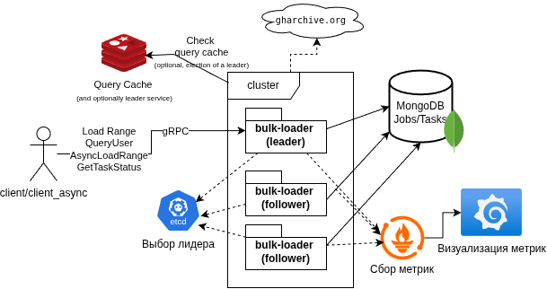

# gh-archive-bulk-loader
Масштабируемый cервис для массовой загрузки GitHub Events (источник: [https://www.gharchive.org](https://www.gharchive.org)), хранения «как есть» в MongoDB, кеширования результатов запросов в Redis, выбора лидера через Redis или etcd и сбора метрик через Prometheus + Dashboards Grafana. Pet‑project с акцентом на устойчивость, наблюдаемость и масштабирование.

## Архитектура сервиса

* client/client_async — go клиент для ручного тестирования пакетной загрузки
* bulk-loader — go сервер и бизнес-логика
* MongoDB — основное хранилище событий и метаданных задач (`jobs`)
* Redis — кеширование пользовательских запросов и простая реализация leader election (альтернатива etcd)
* etcd — альтернатива для leader election
* Prometheus — сбор метрик
* gRPC / Protobuf — внешний API
* Grafana — визуализация метрик

## API 

Основные RPC:

* `LoadRange(LoadRequest) -> LoadResponse` — синхронная пакетная загрузка диапазона дат; возвращает количество вставленных записей.
* `AsyncLoadRange(LoadRequest) -> AsyncLoadResponse` — приём асинхронной загрузки; возвращает `task_id`.
* `GetTaskStatus(TaskStatusRequest) -> TaskStatusResponse` — получение статуса асинхронной задачи (статус, прогресс, кол-во URLs, вставленных записей, ошибки, временные метки).
* `QueryUser(UserQuery) -> UserQueryResponse` — возвращает агрегации для пользователя: `events`, `events_by_ym`, `pushed_to`.

## Метрики

В проекте есть пакет `infrastructure/metrics/metrics.go` с зарегистрированными Prometheus-метриками и функцией `StartMetricsServer()`.

Основные метрики, которые регистрируются:

* `gharchive_download_duration_seconds` — histogram: время скачивания одного архива
* `mongodb_write_duration_seconds` — histogram: время вставки батча в MongoDB
* `mongodb_inserted_records_total` — counter: число вставленных документов
* `gharchive_errors_total{type}` — countervec: классифицированные ошибки
* `gharchive_download_to_write_ratio` — gauge: отношение времени скачивания к времени записи
* `records_processed_per_second` — gauge: скорость обработки записей
* `redis_cache_hits_total` — counter: попадания в кеш
* `redis_cache_misses_total` — counter: промахи кеша

## docker-compose (локальная конфигурация)

В корне проекта есть `docker-compose.yml` с сервисами для локальной разработки и тестирования. Ключевые сервисы и их назначение:

* `mongo` — MongoDB (порт 27017), том `mongo_data` для персистентности.
* `redis` — Redis (порт 6379), том `redis_data`.
* `etcd` — etcd (порт 2379) для альтернативного leader election.
* `mongo_loader_1`, `mongo_loader_2`, `mongo_loader_3` — три инстанса сервиса (реплики). Для каждого:

  * контейнер строится из `Dockerfile.loader`;
  * задаются env: `REPLICA_ID` и `LEADER_LEASE` (TTL в секундах);
  * команда запуска содержит позиционные аргументы: `mongodb_uri db_name collection_name redis_host:port <other>`;
  * экспонируются порты для gRPC (например 1234/1235/1236) и для метрик (2112/2113/2114).
* `prometheus` — Prometheus (порт 9090) с конфигом `prometheus.yml`.
* `grafana` — Grafana (порт 3000) для визуализации метрик.

Тома: `mongo_data`, `grafana_data`, `redis_data`, `etcd_data`.

## Потоки данных и компоненты

* Источник данных: gharchive (архивы по часам). Компонент `infrastructure/storage/gharchive.go` отвечает за скачивание.
* Bulk-вставки в Mongo выполняются пакетами (InsertMany) для максимальной пропускной способности.
* Во время пакетной загрузки собирается список затронутых пользователей — он хранится в metadata задачи (collection `jobs`) и используется для целевой инвалидации кеша.
* Запросы на агрегацию пользователя обслуживаются репозиторием `user_query_repository.go` и кешируются в Redis.

## Кеширование и инвалидация

* Ключи кеша: `user:stats:{username}` (TTL + явная инвалидация).
* При завершении групповой загрузки сервис инвалидации удаляет ключи, соответствующие `affected_users` из метаданных задачи. Инвалидация считается частью задачи: задача остаётся в специальном состоянии, пока инвалидация не выполнена.
* Временная неконсистентность допустима: некоторые клиенты могут получить старые данные из кеша до момента инвалидации.

## Leader election и репликация поведения

* В проекте реализована поддержка выбора лидера через Redis (распределённый lock, SETNX + TTL + продление). Также реализован адаптер для etcd (`infrastructure/storage/etcd/leader.go`) как более надёжная альтернатива для production.
* Приём асинхронных задач (`AsyncLoadRange`) можно направлять на любую реплику; реплика, получив task, может зарегистрировать задачу и, в зависимости от политики, форвардить выполнение лидеру. В ответ клиент получает `task_id` и адрес текущего лидера для опроса статуса (если был форвард).
